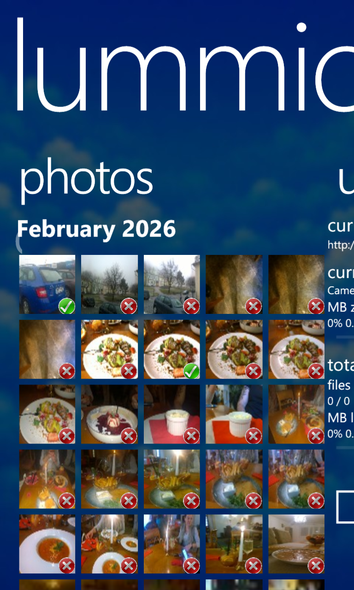
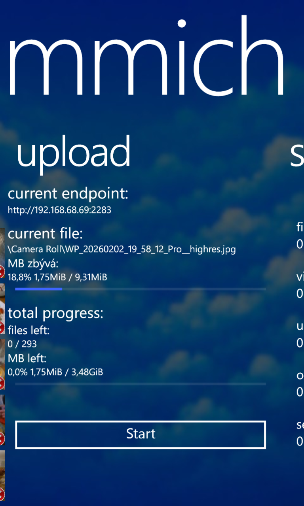
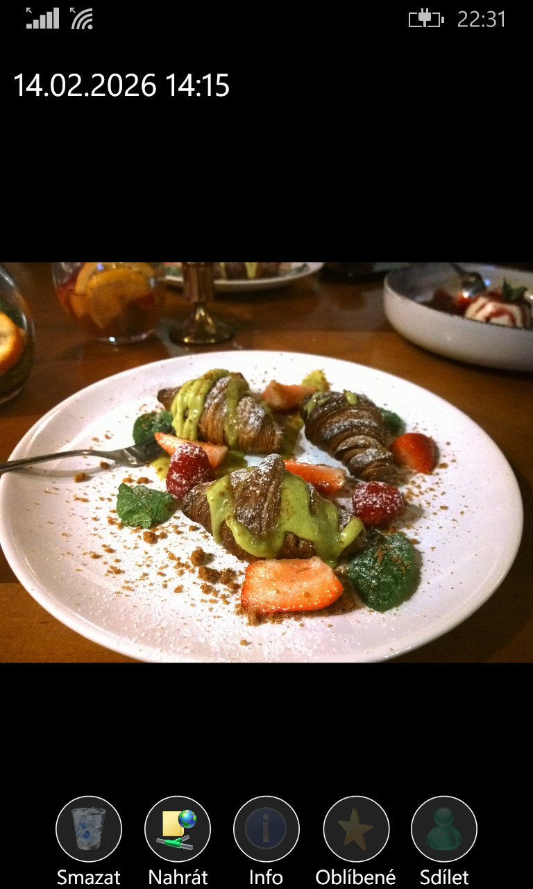

# Lummich
**An Immich client for Windows Phone 8.1**

## Features:
* One click upload all files to Immich
* Local vs Internet server address switching based on current Wi-Fi SSID
  * Supports multiple SSID names at once, useful for larger homes
* Automatic High Res photo deduplication
  * When camera saves 5MPx and 40MPx (_highres) photo, the app will automatically upload only the 40MPx one
* Manual per-file upload
* Works over bad 2G Edge connection
* Allows unsigned HTTPS certificate
* Flicker free thumbnails during scroll

# Currently supported languages
* Czech
* English

## TODO:
* Since the application is in beta, not all features are currently implemented.
* Work in progress features:
  * Deleting file from photo view not implemented
  * Showing photo details is not implemented
  * Favouriting photo is not implemented
  * Share modal is not implemented
* Planned features:
  * Live tiles support
  * Automatic on background uploading
  * Smart search

## Translate
* If you want to translate Immich into your own language:
Take Assets/Language/en.txt, MainPage.en.txt and PhotoViewPage.en.txt, copy them and replace the en with your language's code.     
Then, edit the text files and translate the strings.   
Then either create a github pull request, or create an issue and send me the txt files

## Screenshots

  
  
  

